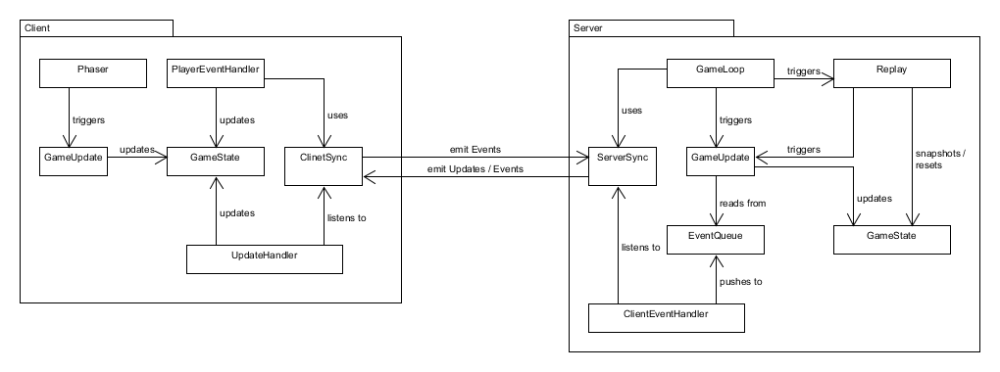
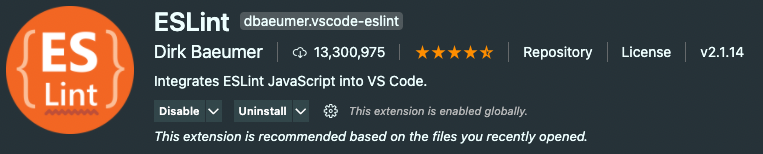
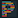
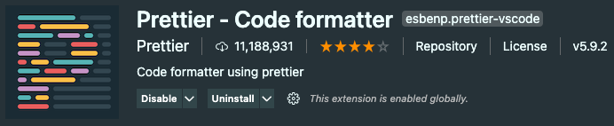
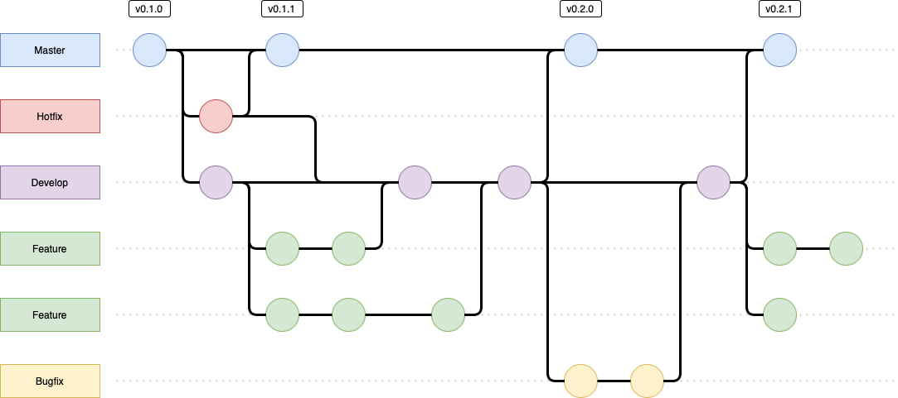
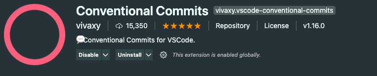
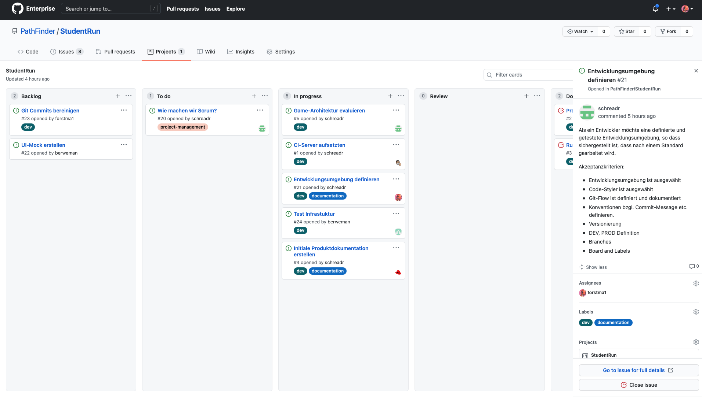

# StudentRun Dokumentation

## Organisation

Das Team hinter StudentRun ist in folgenden drei Scrum-Rollen aufgeteilt:

-   Scrum Master: Adrian Schrempp
-   Product Owner: Dan Hochstrasser
-   Developer Team: Marvin Tseng, Manuel Berweger, Marco Forster

### Managementwerkzeuge

Hauptsächlich wird der GitHub-Server der ZHAW benützt, welcher für die Planung des Projektes innerhalb eines Kanban-Bord verantwortlich ist. Zudem werden im Kanban-Board auch die User Stories erstellt und auf die Teammitglieder aufgeteilt. Die Dokumentation befindet sich als Markdown Datei im Ordner "doc" auf dem Git-Repository.

### Produktanforderungen

Das Spiel StudentRun sollte als Website auf deinem Webserver betrieben sein. Zudem benötigt es eine Datenbank, um die Spielstände oder Scores abspeichern zu können. Die Webseite sollte via URL aufrufbar sein. Die Handhabung des User Interfaces sollte einfach sein, damit sich der Benutzer schnell zurecht findet. Die Bedienung im Spiel selbst muss mit den Pfeiltasten und Leertaste steuerbar sein.

## Vision

### Kontext

Die Software ist ein Spiel, welches dem Spieler erlaubt, durch den Multiplayermodus gegen andere Spieler anzutreten. Das Spiel geht in die Kategorie Jump and Run. Der Begriff Jump and Run bedeutet, dass von einer Seiter der Karte auf die andere Seite gespielt wird. Meistens ist dies wie bei StudentRun von Rechts nach Links. Ziel des Spiel ist es, das Ende des Levels zu erreichen bevor ein Mitspieler dies kann. Die Software wird hauptsächlich für Studenten gemacht, um im Studienalltag eine Abwechslung zu haben. Bei StudentRun wählt sich im Menü der Spieler in einen Raum ein. Sobald dieser Raum voll ist, wird das Spiel gestartet. Beim Spiel StudentRun, wird im kompetitiven Modus in Real-Time gespielt, was bedeutet, dass Aktionen, welche ausgeführt wurden sofort beim Mitspieler ersichtlich sind.

### Ziele und Hauptfunktionen

Die Software ist generell ein Spiel. Sie besteht aus einem Frontend, dem Backend und einer Datenbank. Essentielle Funktionen wie Multiplayer Modus, Grafische Oberfläche und ein schönes Design, sind wichtig, damit das Spiel auch gespielt wird.

Das Spiel ist ein Erfolg sobald es von verschiedenen Studenten gespielt wird.

### Qualitätsattribute

-   Performance: Die Latenz darf maximal 0.5 Sekunden beantragen
-   Skalierbarkeit: Die Software soll so aufgebaut sein, damit vertikal skaliert werden kann.
-   Verfügbarkeit: 99%
-   Security: Die Software selbst sollte unter den heutigen Sicherheitsaspekten abgeschottet sein.
-   Erweiterbarkeit: Es sollten mit der Zeit mehr Levels hinzukommen, wie auch andere Charakteren
-   Flexibilität: Ein Level sollte einfach zu erstellen sein und die Anpassung an der Software sollte Anhang der Dokumentation möglichst einfach sein
-   Zugänglichkeit: Die Software sollte im Browser unter einer URL zugriffbar sein.
-   Benutzerfreundlichkeit: Die Webseite ist einfach bedienbar und hindert dem Spieler nicht spass am Spiel zu haben.

### Bekannte Beschränkungen

Die Ressourcen der virtuellen Maschine auf der das Programm läuft, sind die Systemgrenzen.

### Verwendete Prinzipien

Folgende Prinzipien werden verwendet:

-   Verwendung von SOLID
-   Hohe Kohäsion und minimale Koppelung
-   2-Schichtenmodell: DB - Server

### Architektur

Das Game wird mittels einer Client-Server-Archtektur aufgebaut. Das Spiel läuft auf dem Server und beim jedem Client, die Spielstände werden synchronisiert. Dabei ist der Spielstand des Servers immer massgebend (authoritative Server). Die Spieler verbinden sich mittels Browser (Client) auf den Server. Die grobe Archtitektur des Servers bzw. der Clients sieht so aus:



Die Komponenten haben folgende Verantwortungen:

-   GameState (Server / Client): repräsentiert den aktuellen Spielstand. Zum Beispiel die Position eines Spielers.
-   Action (Server / Client): repräsentiert eine Aktion im Spiel, nimmt bei jedem Tick eine entsprechende Änderung am GameState vor. Ein Grossteil der Aktionen werden von der Physics-Engine verwaltet und abgearbeitet.
-   GameLoop (Server / Client): verwantwortlich für das Zeitmanagement im Spiel. Triggert in einer bestimmten Frequenz Actions.
-   Server- und ClinetSync (Server / Client): synchronisiert den GameState und die Events.
-   EventHandler (Server): verarbeitet Events, die von den Clients ausgelöst wurden, indem er entsprechende Actions erstellt.
-   PlayerEventHandler (Client): handhabt Benutzereingaben indem er entsprechende Aktionen auslöst und passende Events an den Server schickt.
-   UpdateHandler (Client): verarbeitet GameState-Updates vom Server.

Anmerkungen: Zu Beginn wird das Spiel nur auf dem Server laufen und der Game-State als ganzes synchronisiert. Dies vereinfacht die Implementation.

### Externe Schnittstellen

Es gibt keine Schnittstelle, welche extern angesprochen wird.

### Entscheidungs-Logbuch

Wir haben folgende Entscheidungen getroffen:

#### 01.03.2021

-   NodeJS + Express: wir verwenden fürs Backend NodeJS zusammen mit Express, da dies ein weitverbreiteter Techstack ist für WebServer. Ausserdem ist Node einfach in der Handhabung bzgl. Build und Deplyment.
-   Mongoose: wir verwende MongeDB als Datenbank, da MongoDB eine gute JavaScript-Integration bereitstellt und wir nur wenig Daten speichern müssen.

#### 09.03.2021

-   Socket.io: für die Kommunikation zwischen Client und Server verwenden wir socket.io, da dieses Framework sehr verbreitet ist. Da es sein kann, dass socket.io (läfut über TCP) zu langsam ist für unser Spiel, werden wir ein Abstraktionslayer einbauen.
-   Phaser: Phaser ist ein Frontend Gaming Framework, dass sehr verbreitet ist und eine grosse Community hat.
-   matter.js: Die Physics-Engine bietet grosse Funktionalität und wird oft genutzt. Ausserdem lässt sie sich in Phaser integrieren.

#### 15.03.2021

-   NodeJS Version 15.x: Wir haben für die aktuellste NodeJS-Version 15.x entschieden.

## Technologien

Technologiestack:

-   [MongoDB](https://www.mongodb.com) (Non-SQL Datenbank)
-   [Express](https://expressjs.com) (Webserver-Framework für NodeJS)
-   [NodeJS](https://nodejs.org/en/) (JavaScript Runtime im Backend)
-   [Socket.io](https://socket.io) (Websocket-Kommunikation)
-   [Phaser](https://phaser.io) (Frontend Game Engine)
-   [matter.js](https://brm.io/matter-js/) (Physics Engine)
-   [Jest](https://jestjs.io) (JavaScript Testing-Framework)
-   [ESLint](https://eslint.org) (JavaScript Linter)
-   [Prettier](https://prettier.io) (Code Formatter)

## User Stories

Die User Stories wurden unter folgendem Link dokumentiert: [User Stories](https://github.zhaw.ch/PathFinder/StudentRun/projects/1)

-   [Gameplay](https://github.zhaw.ch/PathFinder/StudentRun/issues/45)
-   [Chat](https://github.zhaw.ch/PathFinder/StudentRun/issues/26)
-   [Main Menu](https://github.zhaw.ch/PathFinder/StudentRun/issues/31)
-   [Achievments](https://github.zhaw.ch/PathFinder/StudentRun/issues/29)
-   [Ziel](https://github.zhaw.ch/PathFinder/StudentRun/issues/34)
-   [(Touch) Mobile](https://github.zhaw.ch/PathFinder/StudentRun/issues/36)
-   [Persistente Daten pro Spieler](https://github.zhaw.ch/PathFinder/StudentRun/issues/39)
-   [Level-Voting](https://github.zhaw.ch/PathFinder/StudentRun/issues/40)
-   [Spielräume](https://github.zhaw.ch/PathFinder/StudentRun/issues/43)
-   [Verschiedene Levels](https://github.zhaw.ch/PathFinder/StudentRun/issues/35)
-   [Spielfigur & Name](https://github.zhaw.ch/PathFinder/StudentRun/issues/37)
-   [Items](https://github.zhaw.ch/PathFinder/StudentRun/issues/32)
-   [Multiplayer](https://github.zhaw.ch/PathFinder/StudentRun/issues/30)
-   [Rangliste](https://github.zhaw.ch/PathFinder/StudentRun/issues/27)
-   [Score anzeigen](https://github.zhaw.ch/PathFinder/StudentRun/issues/44)
-   [DB-Aufbau über Mongoose](https://github.zhaw.ch/PathFinder/StudentRun/issues/38)
-   [Demo-Level erstellen](https://github.zhaw.ch/PathFinder/StudentRun/issues/33)
-   [Game starten](https://github.zhaw.ch/PathFinder/StudentRun/issues/28)

## Build Automation - CI/CD

Build Automation mit CI/CD steigert die Produkt Qualität und reduziert Risiken durch automatisches Testen und Code-Auditing.

### Software Automation Pipeline

Für die Umsetzung der Pipeline verwenden wir [Azure DevOps von Microsoft](https://dev.azure.com/zhaw-gruppe-x/Student%20Run). Der dazu benötigter DevOps Agent, welche die Workflows bearbeitet, wurde auf unserem PSIT Server installiert.


Jeder neuer Merge auf dem Master Branche stösst die Pipeline an, dieser bearbeitet folgende Punkte.

1. Unit Tests mittels [Jest](https://jestjs.io)
2. Security Auditing & Code Analyse mit [SonarCloud](https://sonarcloud.io/dashboard?id=StudentRun)
3. Automatisches Deployment auf den PSIT Server nach erfolgreich bestandenen Akzeptanztests.

### Pull Request Validation

Um Code Reviews zu beschleunigen wird jeder Pull Request durch Tests & Analyse verifiziert. Der daraus generierte Bericht wird als Kommentar im Pull Request hinterlegt.

## Entwickler-Standards

### Entwicklungsumgebung

 Als **integrierte Entwicklungsumgebung** (_integrated development environment, IDE_) wurde **Visual Studio Code** (https://code.visualstudio.com) von Microsoft ausgewählt, welches gratis ist, Open-Source entwickelt wird, und auf allen drei grossen Betriebssystemen (Windows, macOS, Linux) verfügbar ist.

### Programmierstil

#### Code Analyse

 Um einen sauberen Programmierstil zu fördern wird das Linting-Tool **ESLint** eingesetzt, welches den Entwickler seinen Code analysiert, Probleme und Verbesserungen identifiziert und diese dem Entwickler meldet. Dies führt dazu, dass der Code in der Regel konsistenter und freier von Bugs wird.

Die ESLint Extension für Visual Studio Code wird vorausgesetzt:



Um eine saubere Zusammenarbeit zwischen ESLint mit Jest und Prettier sicherzustellen, sind die Erweiterungen `eslint-plugin-jest` und `eslint-config-prettier` nötig.

ESLint-Konfiguration (`app/.eslintrc.json`):

```json
{
	"env": {
		"commonjs": true,
		"es2021": true,
		"node": true,
		"jest": true
	},
	"plugins": ["jest"],
	"extends": "eslint:recommended",
	"parserOptions": {
		"ecmaVersion": 12
	},
	"rules": {}
}
```

#### Code Formatierung

 Um eine einheitliche Formatierung der Dateien durchzusetzen, wird der 'Code formatter' **Prettier** (https://prettier.io) verwendet.

Entwickler müssen für eine nahtlose Integration mit der Entwicklungsumgebung die Prettier Extension für Visual Studio Code installieren:



Folgende Konfigurationen wurden für das Projekt vorgenommen, welche sich von den Standard-Einstellungen (https://prettier.io/docs/en/options.html) von Prettier abweichen:

-   **Tab Width:** 4 (Default: 2)
    _Specify the number of spaces per indentation-level._
-   **Tabs:** true (Default: false)
    _Indent lines with tabs instead of spaces._

Die Konfiguration wurde im `.vscode/settings.json` eingetragen, damit diese nicht mehrfach in den verschiedenen Projekten (backend, frontend, ...) eingetragen werden mussten.

```json
{
	"editor.defaultFormatter": "esbenp.prettier-vscode",
	"editor.formatOnSave": true,
	"prettier.tabWidth": 4,
	"prettier.useTabs": true
}
```

### Branches

-   master (Releases, PROD)
-   develop (Entwicklung, DEV)
-   Weitere Branches nach folgendem Muster: `<Type>/<Nr.>-<Story-Titel>`
    Beispiel: `feature/#23-Jump-Mechanik`

Types:

-   Feature (`feature/<Nr.>-<Story-Titel>`)
-   Bugfix (`bugfix/<Nr.>-<Story-Titel>`)
-   Hotfix (`hotfix/<Nr.>-<Story-Titel>`)
-   Release (`bugfix/<Nr.>-<Story-Titel>`)
-   Other (`<Nr.>-<Story-Titel>`)



### Commits

 Commits werden nach Einhaltung der [Conventional Commits](https://www.conventionalcommits.org/en/v1.0.0/) Konvention erstellt.

```markdown
<type>[optional scope]: <description>

[optional body]

[optional footer(s)]
```

Siehe vollständige Spezifikation unter https://www.conventionalcommits.org/en/v1.0.0/#specification.

Die Erweiterung **Conventional Commits** für Visual Studio Code hilft sehr bei der Einhaltung der Konvention:



### Versionierung

Die Software wird nach [Semantic Versioning 2.0.0](https://semver.org) versioniert nach dem Modell: `MAJOR.MINOR.PATCH`

### Tracking

Das Projekt wird über ein **Kanban-Board** direkt auf [GitHub Projects](https://github.zhaw.ch/PathFinder/StudentRun/projects/1) getrackt und gemanaged. Die User Stories werden nach den Status Backlog, To do, In progress, Review und Done gruppiert. Der Einsatz von Labels hilft weiter bei der Identifizierung der einzelnen User Stories.


